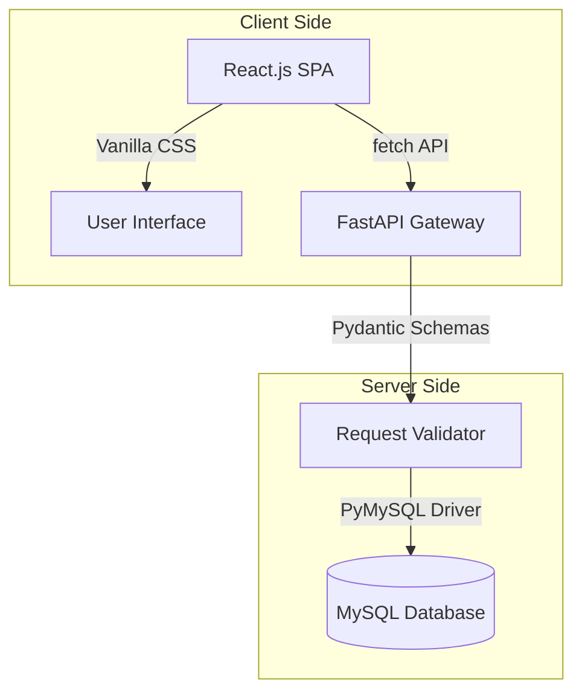

# PharmaSafe ERP - Pharmacy Management & Billing System

PharmaSafe ERP is a robust, full-stack pharmacy management and POS (Point-of-Sale) billing application designed for college project submission. It integrates a fast **FastAPI** backend, a **MySQL** relational database, and an interactive **React.js** single-page application dashboard.

---

## 🏗️ System Architecture



---

## ⚡ Key Features

1. **POS Billing Terminal**:
   - Dynamic search by medicine name or batch code.
   - Live Shopping Cart adjustments with automatic subtotal updates.
   - Flat **5% GST tax calculation** automatically computed.
   - **Automatic Inventory Deduction**: Deducts medicine quantities from the MySQL database upon transaction checkout.
   - Prevents stock overselling (returns error if input quantity > stock).

2. **Real-Time Analytics Dashboard**:
   - Count trackers for total medicines and registered customers.
   - Alert systems flagging **low stock batches** (warning threshold: < 15 items).
   - Financial counters displaying overall gross revenue.
   - **Medicine Expiry Monitor**: Tracks and warns about batches expiring in the next 120 days.
   - Transactions tracker listing the last 5 invoices.

3. **10 Complete Database CRUD Modules**:
   - **Medicines**: General medicine names, categorization, and prescription requirements.
   - **Suppliers**: Wholesale distributor contact details.
   - **Customers**: Patient medical accounts and coordinates.
   - **Doctors**: Registering prescription physicians and hospital affiliations.
   - **Stock Batches**: Manage batch codes, retail selling prices, cost prices, quantities, and expiration dates.
   - **Prescriptions**: Links doctors to patients and creates prescription files.
   - **Prescription Items**: Specific medicine dosages and guidelines.
   - **Purchase Orders**: Log wholesale transactions from suppliers.
   - **Sales & Sale Items**: Permanent invoice history mapping line-by-line item receipts.

---

## 🛠️ Technology Stack

- **Frontend**: React.js (Vite SPA template, TypeScript), Vanilla HTML5/CSS3 (Google Fonts Outfit & Inter).
- **Backend**: FastAPI (Python 3.x), Uvicorn server, Pydantic, PyMySQL.
- **Database**: MySQL.

---

## 🚀 Setup & Execution Guide

### 1. Database Setup
1. Start your local MySQL server.
2. The backend automatically creates the `pharmasafe` database and builds all 10 tables on startup using credentials defined in `db.py`.
3. Default credentials (change in [db.py](file:///D:/my_projects/netcraft/MAIN_PROJECT/PharmaSafe/db.py) if different):
   - **Host**: `localhost`
   - **User**: `root`
   - **Password**: `1234`

### 2. Run Backend (FastAPI)
1. Open the project folder in PyCharm.
2. Launch the terminal (ensure the `.venv` virtual environment is active):
   ```powershell
   .venv\Scripts\activate
   ```
3. Start the FastAPI development server:
   ```powershell
   python -m uvicorn main:app --reload
   ```
   *The backend will run on `http://127.0.0.1:8000`.*

### 3. Run Frontend (React.js)
1. Open a new tab in your PyCharm terminal.
2. Navigate into the frontend folder:
   ```bash
   cd frontend
   ```
3. Run the development server:
   ```bash
   npm run dev
   ```
   *The frontend will start on `http://localhost:5173`.*

4. Open `http://localhost:5173` in any web browser to run the ERP!
